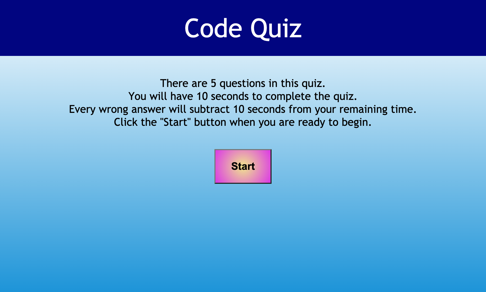

# Code_Quiz

## Description

This quiz asks 5 questions and collects the users score.
It will finish if time runs out.
It will also subtract 10 seconds for every incorrect answer.

## Link to Application

https://travis-springer.github.io/Code_Quiz/

## Screenshot

